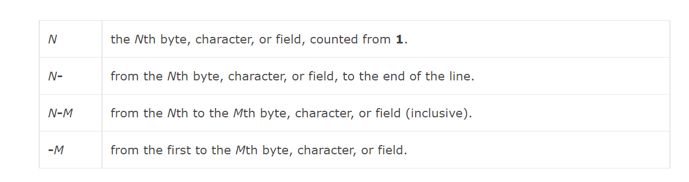

# text-processing-cut-6

# 目次

<!-- @import "[TOC]" {cmd="toc" depthFrom=2 depthTo=6 orderedList=false} -->
<!-- code_chunk_output -->

- [URL](#url)
- [感想](#感想)
- [参考](#参考)

<!-- /code_chunk_output -->

## URL

https://www.hackerrank.com/challenges/text-processing-cut-6/problem

## 感想

- 範囲の時に空白にしといた場合最後までという意味になるようである。

## 参考

- https://www.computerhope.com/unix/ucut.htm#Specifying-LIST
    - 
